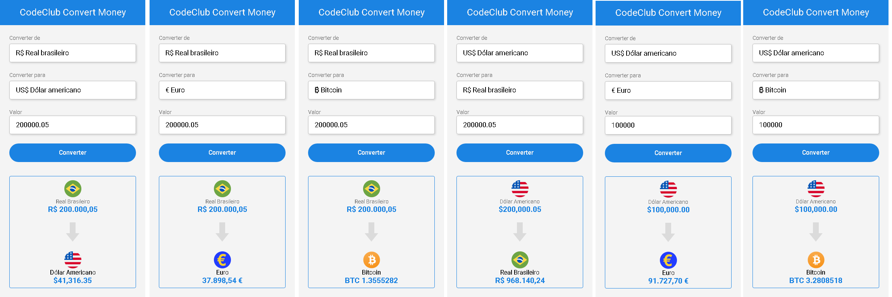

<h1>Conversor de Moedas (Convert Money)</h1>
 
<h2>Este programa foi desenvolvido nas seguintes linguagens:</h2>
 

 
 

<h2>Conversor da moeda de Real 'R$' para Dólar Americano: 'US$', Euro: € e Bitcoin.   <a href ="https://project-converter-money.netlify.app/" Target ="_blank">Clique Aqui </a>para carregar o Programa:</h2>

 
 

